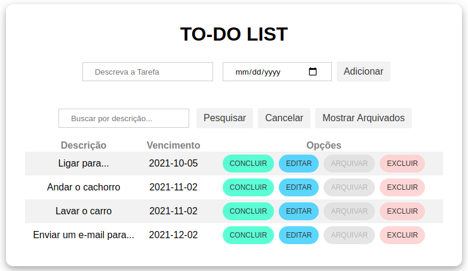

 # TODO-LIST App
 ## _Desenvolvimento de um TODO-LIST com 'stack' MERN_
Neste repositório será desenvolvido uma aplicação simples de 'ToDo list' utilizando tecnologias da stack MERN (MongoDB, Express.js, React.js e Node.js).
</br>
</br>

</br>

## Tecnologias

### cliente
* **React.js** - biblioteca JavaScript para desenvolver interfaces de usuário.

### servidor
* **Node.js** - ambiente de execução JavaScript para desenvolvimento back-end.
* **Express.js** - framework web para Node.js.
* **Mongoose** - biblioteca JavaScript utilizada para criar conexão e trabalhar com Banco de dados MongoDB.

### banco de dados
* **MongoDB** - Banco de dados orientado a documentos, classificado como NoSQL.

## Executar a aplicação
A aplicação pode ser executar da seguinte maneira:
* Manualmente, no Visual Studio Code para executar o lado cliente e servidor, utilizando `docker-compose` para subir a imagem do MongoDB.

### Visual Studio Code
Para executar a aplicação manualmente, é necessário executar o front-end e back-end separadamente, além de ter o banco de dados funcionando após executar o comando `docker-compose`.

#### Etapas
1. Executar, conforme a seguir, os 'comandos servidor' e em seguida os 'comandos cliente'.
2. Acessar a aplicação 'cliente' em localhost:3000.

##### comandos servidor
```bash
# acessar diretório 'server'
cd ./server

# instalar pacotes e dependências
npm install

# subir imagem do banco de dados MongoDB
docker-compose -f docker-compose.yml

# executar a aplicação servidor
npm start
```
##### comandos cliente
```bash
# acessar diretório 'client'
cd ./client

# instalar pacotes e dependências
npm install

# executar a aplicação cliente
npm start
```